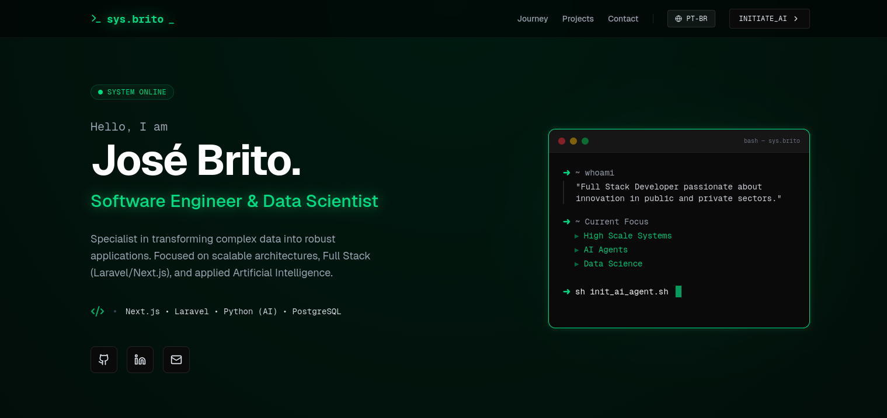

# sys.brito | Developer Portfolio


> A high-performance, cyberpunk-themed portfolio designed for a Software Engineer & Data Scientist. Built with the modern web stack.



## 🚀 About The Project

This portfolio was engineered to be more than just a resume; it's a showcase of technical skills. It features a custom **"Terminal/Glassmorphism"** design system, fully responsive layout, and integrated analytics.

**Live Demo:** [josevbrito.com](https://josevbrito.com)

### ✨ Key Features

* **Cyberpunk Aesthetic:** Custom Tailwind CSS configuration for a Neon Green/Deep Black visual identity.
* **Internationalization (i18n):** Built-in support for **Portuguese (PT-BR)** and **English (EN)** via React Context API (no external heavy libraries).
* **Performance First:** Optimized with Next.js App Router and Server Components (in progress).
* **Interactive UI:** Smooth animations using **Framer Motion**.
* **Contact System:** Serverless form handling via **Formspree**.
* **Monitoring:** Integrated **Vercel Analytics** and **Speed Insights** for real-time performance tracking.

---

## 🛠️ Tech Stack

### Core
* **Framework:** [Next.js 15](https://nextjs.org/) (App Router)
* **Language:** [TypeScript](https://www.typescriptlang.org/)
* **Styling:** [Tailwind CSS](https://tailwindcss.com/)

### UI & UX
* **Icons:** [Lucide React](https://lucide.dev/)
* **Animations:** [Framer Motion](https://www.framer.com/motion/)
* **Font:** Geist Sans & Geist Mono (Optimized via `next/font`)

### Infrastructure & Tools
* **Deployment:** [Vercel](https://vercel.com/)
* **Form Handling:** [Formspree](https://formspree.io/)
* **Linting:** ESLint

---

## ⚡ Getting Started

To run this project locally, follow these steps:

### Prerequisites
* Node.js 18+ installed.
* npm or yarn.

### Installation

1.  **Clone the repository**
    ```bash
    git clone https://github.com/josevbrito/portfolio-sys-brito.git
    cd portfolio-sys-brito
    ```

2.  **Install dependencies**
    ```bash
    npm install
    ```

3.  **Configure Environment Variables**
    Create a `.env.local` file in the root directory and add your Formspree endpoint:
    ```env
    NEXT_PUBLIC_FORMSPREE_URL=https://formspree.io/f/CODE
    ```

4.  **Run the development server**
    ```bash
    npm run dev
    ```

5.  Open [http://localhost:3000](http://localhost:3000) in your browser.

---

## 📂 Project Structure

```bash
portfolio-sys-brito/
├── app/
│   ├── components/    # Reusable UI components (Navbar, Footer)
│   ├── context/       # Global State (LanguageContext)
│   ├── projects/      # Project listing and dynamic details pages
│   ├── data.ts        # Centralized data source (Content & Translations)
│   ├── layout.tsx     # Root layout & Analytics providers
│   └── page.tsx       # Homepage (Hero, Timeline, Contact)
├── public/            # Static assets (images, icons)
└── ...config files
````

-----

## 🧪 Performance Optimization (In Progress)

Current efforts are focused on improving **Total Blocking Time (TBT)** and **Lighthouse Scores** by:

  * Refactoring huge Client Components into smaller islands.
  * Moving static content rendering to the Server.
  * Optimizing font loading strategies.

-----

## 📬 Contact

**José Brito** - Software Engineer & Data Scientist

  * **Email:** contact@josevbrito.com
  * **LinkedIn:** [linkedin.com/in/josevbrito](https://linkedin.com/in/josevbrito/)
  * **GitHub:** [github.com/josevbrito](https://github.com/josevbrito)

-----

<p align="center"\>
<i\>Architected with ❤️ and ☕ in Brazil.\</i\>
</p\>